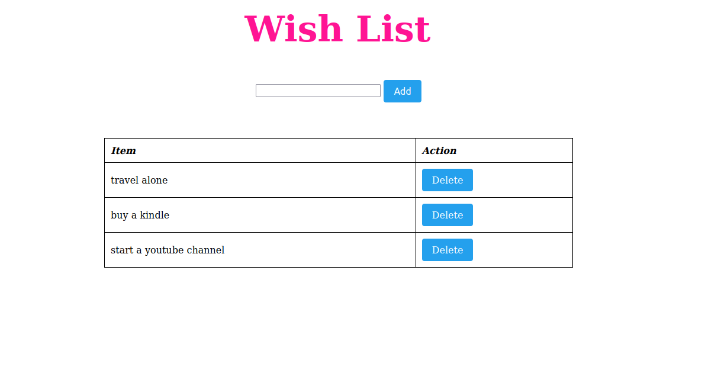
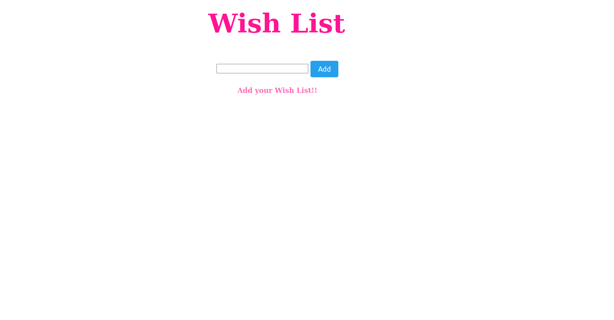

# TODO- Python Flask 

This is a very basic version of TODO App made using Python Flask. We have not used database but a simple list to store items.The project is made for tutorial purpose.


## Installing Flask

Run the following in the terminal to install the Pygamezero library.

```pip install Flask```


## Prerequisite

    Python
    Flask

## To Learn more
[Flask Documentation](https://flask.palletsprojects.com/en/2.0.x/)


